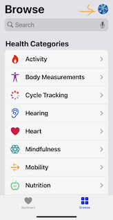
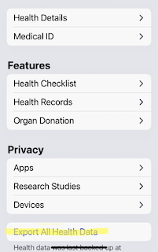

# apple_health

The iPhone Health App stores Apple Watch data, user-keyed-in data and clinical data from health providers. It provides a feature to export the user's health data to other devices. 


    

This repo has the following:

1. Programs that extract elements from the Health App's exported xml file, and then 
transform and load the elements into various csv files. The csv files represent different health and activity dimensions.

2. Programs that generate csv files for exploring my Apple Watch activity data using Jupyter notebooks. These programs are found in [stories_helper_programs](stories_helper_programs).

3. Data stories regarding Apple Watch and Apple Health data are found in the [apple_watch_stories](apple_watch_stories) folder.


The code that processes the Health App's exported xml file only works with iOS 14. The code is not backward compatible. iOS 14's Health App removed the
appleMoveMinutes and appleMoveMinutesGoal attributes from the ActivitySummary xml element. These attributes were replaced by appleMoveTime and appleMoveTimeGoal.


This is the xml structure of the exported health data:

```xml
<?xml version="1.0" encoding="UTF-8"?>
<!DOCTYPE HealthData [
<!-- HealthKit Export Version: 11 -->
<!ELEMENT HealthData (ExportDate,Me,(Record|Correlation|Workout|ActivitySummary|ClinicalRecord)*)>
<!ATTLIST HealthData
  locale CDATA #REQUIRED
>
<!ELEMENT ExportDate EMPTY>
<!ATTLIST ExportDate
  value CDATA #REQUIRED
>
<!ELEMENT Me EMPTY>
<!ATTLIST Me
  HKCharacteristicTypeIdentifierDateOfBirth         CDATA #REQUIRED
  HKCharacteristicTypeIdentifierBiologicalSex       CDATA #REQUIRED
  HKCharacteristicTypeIdentifierBloodType           CDATA #REQUIRED
  HKCharacteristicTypeIdentifierFitzpatrickSkinType CDATA #REQUIRED
>
<!ELEMENT Record ((MetadataEntry|HeartRateVariabilityMetadataList)*)>
<!ATTLIST Record
  type          CDATA #REQUIRED
  unit          CDATA #IMPLIED
  value         CDATA #IMPLIED
  sourceName    CDATA #REQUIRED
  sourceVersion CDATA #IMPLIED
  device        CDATA #IMPLIED
  creationDate  CDATA #IMPLIED
  startDate     CDATA #REQUIRED
  endDate       CDATA #REQUIRED
>
<!-- Note: Any Records that appear as children of a correlation also appear as top-level records in this document. -->
<!ELEMENT Correlation ((MetadataEntry|Record)*)>
<!ATTLIST Correlation
  type          CDATA #REQUIRED
  sourceName    CDATA #REQUIRED
  sourceVersion CDATA #IMPLIED
  device        CDATA #IMPLIED
  creationDate  CDATA #IMPLIED
  startDate     CDATA #REQUIRED
  endDate       CDATA #REQUIRED
>
<!ELEMENT Workout ((MetadataEntry|WorkoutEvent|WorkoutRoute)*)>
<!ATTLIST Workout
  workoutActivityType   CDATA #REQUIRED
  duration              CDATA #IMPLIED
  durationUnit          CDATA #IMPLIED
  totalDistance         CDATA #IMPLIED
  totalDistanceUnit     CDATA #IMPLIED
  totalEnergyBurned     CDATA #IMPLIED
  totalEnergyBurnedUnit CDATA #IMPLIED
  sourceName            CDATA #REQUIRED
  sourceVersion         CDATA #IMPLIED
  device                CDATA #IMPLIED
  creationDate          CDATA #IMPLIED
  startDate             CDATA #REQUIRED
  endDate               CDATA #REQUIRED
>
<!ELEMENT WorkoutEvent EMPTY>
<!ATTLIST WorkoutEvent
  type         CDATA #REQUIRED
  date         CDATA #REQUIRED
  duration     CDATA #IMPLIED
  durationUnit CDATA #IMPLIED
>
<!ELEMENT WorkoutRoute ((MetadataEntry|FileReference)*)>
<!ATTLIST WorkoutRoute
  sourceName    CDATA #REQUIRED
  sourceVersion CDATA #IMPLIED
  device        CDATA #IMPLIED
  creationDate  CDATA #IMPLIED
  startDate     CDATA #REQUIRED
  endDate       CDATA #REQUIRED
>
<!ELEMENT FileReference EMPTY>
<!ATTLIST FileReference
  path CDATA #REQUIRED
>
<!ELEMENT ActivitySummary EMPTY>
<!ATTLIST ActivitySummary
  dateComponents           CDATA #IMPLIED
  activeEnergyBurned       CDATA #IMPLIED
  activeEnergyBurnedGoal   CDATA #IMPLIED
  activeEnergyBurnedUnit   CDATA #IMPLIED
  appleMoveMinutes         CDATA #IMPLIED
  appleMoveMinutesGoal     CDATA #IMPLIED
  appleExerciseTime        CDATA #IMPLIED
  appleExerciseTimeGoal    CDATA #IMPLIED
  appleStandHours          CDATA #IMPLIED
  appleStandHoursGoal      CDATA #IMPLIED
>
<!ELEMENT MetadataEntry EMPTY>
<!ATTLIST MetadataEntry
  key   CDATA #REQUIRED
  value CDATA #REQUIRED
>
<!-- Note: Heart Rate Variability records captured by Apple Watch may include an associated list of instantaneous beats-per-minute readings. -->
<!ELEMENT HeartRateVariabilityMetadataList (InstantaneousBeatsPerMinute*)>
<!ELEMENT InstantaneousBeatsPerMinute EMPTY>
<!ATTLIST InstantaneousBeatsPerMinute
  bpm  CDATA #REQUIRED
  time CDATA #REQUIRED
>
<!ELEMENT ClinicalRecord EMPTY>
<!ATTLIST ClinicalRecord
  type              CDATA #REQUIRED
  identifier        CDATA #REQUIRED
  sourceName        CDATA #REQUIRED
  sourceURL         CDATA #REQUIRED
  fhirVersion       CDATA #REQUIRED
  receivedDate      CDATA #REQUIRED
  resourceFilePath  CDATA #REQUIRED
>
<!ELEMENT Audiogram EMPTY>
<!ATTLIST Audiogram
  type          CDATA #REQUIRED
  sourceName    CDATA #REQUIRED
  sourceVersion CDATA #IMPLIED
  device        CDATA #IMPLIED
  creationDate  CDATA #IMPLIED
  startDate     CDATA #REQUIRED
  endDate       CDATA #REQUIRED
>
<!ELEMENT SensitivityPoint EMPTY>
<!ATTLIST SensitivityPoint
  frequencyValue   CDATA #REQUIRED
  frequencyUnit    CDATA #REQUIRED
  leftEarValue     CDATA #IMPLIED
  leftEarUnit      CDATA #IMPLIED
  rightEarValue    CDATA #IMPLIED
  rightEarUnit     CDATA #IMPLIED
>
]>
<HealthData locale="en_US">
</HealthData>

```
